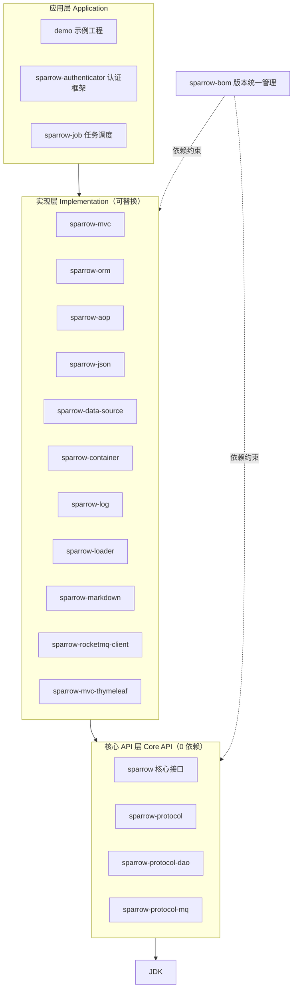
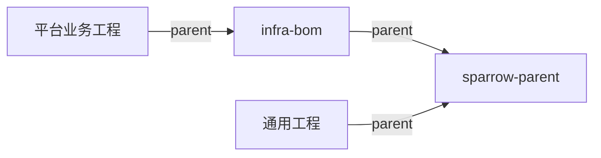

麻雀虽小，五脏俱全
===

> sparrow 源自中国俗语「麻雀虽小，五脏俱全」，全力打造一个全新的 **低耦合、0 依赖、高性能** 的 Java 基础框架。

你是否遇到过这些问题？

- 工程代码越来越臃肿，却说不清哪些依赖是真正需要的？
- 为了一个很小的功能，被迫引入一整个庞大的框架？
- 项目里因为 jar 包冲突折腾很久？
- 相似的框架提供一致的业务能力，对外的接口却各不相同，无法统一？
- 有没有想过只依赖 JDK 就实现一个 WEB 工程？

如果这些戳中了你的痛点，那么 sparrow 非常适合你。

基于 OOP 的基本思想，sparrow 只定义一层 **API**，把「做什么」和「怎么做」彻底解耦。

设计理念
---

- **相信程序员**

  很多框架之所以重，一个重要原因是「不相信程序员」，把简单的事情层层封装。sparrow 从 JDK 出发，尽量不依赖第三方 jar 包，让程序跑得更快，也让原理更透明。

- **从 0 开始**

  技术更像一层窗户纸——捅破了就很简单，捅不破就如隔山。sparrow 从 0 构建，让知识连贯起来，不只让程序高效，更让程序员高效。

- **0 依赖**

  框架只实现最简单、最核心的能力，尽量不依赖任何框架（包括 Spring）。

- **解耦 / 隔离**

  `sparrow` 模块只定义接口，具体实现放在其它模块中，是否引入由业务端决定，实现最大化解耦。

- **扩展**

  遵循开闭原则，对业务提供扩展点。

架构
---



分层说明：

| 层次 | 模块 | 职责 |
| --- | --- | --- |
| 应用层 | `demo`、`sparrow-authenticator`、`sparrow-job` | 面向业务，按需组合实现层模块 |
| 实现层 | `sparrow-mvc` / `sparrow-orm` / `sparrow-json` … | 各能力的可替换实现 |
| 核心 API 层 | `sparrow`、`sparrow-protocol(-dao/-mq)` | 仅定义接口与协议，只依赖 JDK |
| 版本管理 | `sparrow-bom` | 统一各模块版本 |

依赖方向自上而下：应用层 → 实现层 → 核心 API 层 → JDK，上层依赖抽象，实现可替换。

模块说明
---

| 模块 | 说明 |
| --- | --- |
| [`sparrow-bom`](sparrow-bom/README.md) | 物料清单（BOM），统一管理各模块版本（含 `sparrow-parent` 与 `infra-bom`） |
| `sparrow` | 核心 API 层，定义框架全部接口与抽象，仅依赖 JDK |
| `sparrow-protocol` | 领域协议（DDD）与通用常量、分页等基础协议 |
| `sparrow-protocol-dao` | DAO 数据访问协议接口 |
| `sparrow-protocol-mq` | 消息队列（MQ）协议接口 |
| `sparrow-json` | JSON 序列化实现 |
| `sparrow-data-source` | 数据源实现 |
| `sparrow-loader` | 类加载器与代码生成（CG） |
| `sparrow-container` | IoC 容器实现 |
| `sparrow-log` | 日志实现（SLF4J 适配） |
| `sparrow-orm` | ORM 实现 |
| `sparrow-mvc` | MVC 框架实现 |
| `sparrow-aop` | AOP 实现 |
| `sparrow-markdown` | Markdown 解析与渲染 |
| `sparrow-rocketmq-client` | RocketMQ 客户端实现 |
| `sparrow-mvc-thymeleaf` | Thymeleaf 模板视图适配 |
| `sparrow-authenticator` | 认证框架（core / gateway / microservice / monolithic / passport starter） |

> 以下为独立子工程，不参与根 POM 聚合构建：

| 模块 | 说明 |
| --- | --- |
| `sparrow-job` | 分布式任务调度 |
| `sparrow-jni` | JNI / C++ 扩展 |
| `gossip` / `apache-gossip` | Gossip 协议 |
| `demo` | 示例工程 |

工程基线（sparrow-bom）
---

`sparrow-bom` 集中维护 Maven 公共配置与组件版本，让业务项目保持一致的构建与接入方式。按需选择 Parent：仅需通用基线时继承 `sparrow-parent`，使用平台组件时继承 `infra-bom`。

- [`sparrow-bom`](sparrow-bom/README.md) — 聚合构建入口，统一工程基线
- [`sparrow-parent`](sparrow-bom/sparrow-parent/README.md) — 通用依赖、编译、测试、质量检查与发布配置
- [`infra-bom`](sparrow-bom/infra-bom/README.md) — 继承公共基线，统一管理平台组件版本



Quick start
---

构建前请将 `SPARROW_STYLE_DIR` 环境变量设为本仓库 `style` 目录的绝对路径，配置方法见 [Checkstyle 构建说明](style/readme.md)。

```bash
# 方式一：直接聚合构建
cd sparrow-bom
mvn clean install -Dmaven.test.skip
cd ..
mvn clean install -Dmaven.test.skip

# 方式二：按依赖顺序逐个构建
sh build.sh
```

项目 Demo
---

http://www.sparrowzoo.com

愿景
---

让程序员脱离 Spring 也能写代码，而且更快、更优雅。

联系
---

email: zh_harry#163.com（`#` 替换为 `@`）


