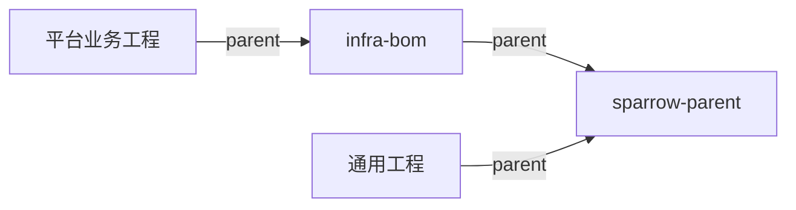

<div align="center">

# Sparrow BOM

**统一工程基线，按需接入平台组件。**

集中维护 Maven 公共配置与组件版本，让业务项目保持一致的构建与接入方式。

[模块关系](#模块关系) · [快速接入](#快速接入) · [构建约定](#构建约定) · [独立发布](#独立发布)

</div>

---

## 模块关系

按需选择 Parent：仅需通用基线时继承 `sparrow-parent`，使用平台组件时继承 `infra-bom`。

| 模块 | 职责 | 接入方式 |
| --- | --- | --- |
| `sparrow-bom` | 聚合构建两个模块，跳过自身部署 | 仓库构建入口 |
| [`sparrow-parent`](sparrow-parent/README.md) | 通用依赖、编译、测试、质量检查与发布配置 | 通用工程直接继承 |
| [`infra-bom`](infra-bom/README.md) | 继承公共基线，统一管理平台组件版本 | 平台业务工程直接继承 |



两个 Parent 独立维护版本。平台组件各自使用独立版本属性，由 `infra-bom` 统一管理版本组合。

## 快速接入

**环境要求：JDK 18+、Maven 3.8.6+。** 编译使用 `maven.compiler.release=18`，同时限定 Java API 与字节码版本。

### 1. 配置 Checkstyle

在执行 Maven 的终端中导出公共规则目录，路径需替换为本机实际目录：

```bash
export SPARROW_STYLE_DIR="/path/to/sparrow-shell/style"
```

该目录必须包含 `sparrow_checkstyle.xml` 和 `check_style_suppressions.xml`。IDE 与其他构建进程也需要读取到此变量。

<details>
<summary>环境变量配置与排错</summary>

- 使用 `printenv SPARROW_STYLE_DIR` 检查当前终端的配置。
- zsh 用户可将 `export` 写入 `~/.zshenv`，再执行 `source ~/.zshenv` 或重新打开终端。
- 报错路径仍含 `${env.SPARROW_STYLE_DIR}`：Maven 未读取到变量。
- 报错路径已展开：检查目录及两个规则文件是否存在。
- `-Dmaven.test.skip` 只跳过测试编译与执行，不会跳过 Checkstyle。

</details>

### 2. 安装 Parent

在本仓库根目录执行，将两个 Parent 按依赖顺序安装到本地 Maven 仓库：

```bash
mvn -B install
```

也可使用已发布到制品仓库的 Parent；远程 SNAPSHOT 制品需要启用仓库的快照解析。业务实际依赖的平台组件也必须能从配置的仓库解析。

### 3. 接入业务项目

使用平台组件时，在业务 `pom.xml` 的 `<modelVersion>` 后声明 Parent：

```xml
<parent>
    <groupId>com.sparrowzoo</groupId>
    <artifactId>infra-bom</artifactId>
    <version>1.0.0-SNAPSHOT</version>
    <relativePath/>
</parent>
```

业务项目声明自己的 `groupId`、`artifactId`、`version`，再在 `<dependencies>` 中按需添加组件。受 Parent 管理的组件可省略依赖版本；**继承 Parent 不会自动引入全部组件。** 示例版本请按实际可用版本调整。

外部项目通过 `<relativePath/>` 按坐标解析 Parent；本仓库的 `infra-bom` 则通过 `../sparrow-parent/pom.xml` 查找同仓父 POM。

- [平台接入指南](infra-bom/README.md#业务项目接入)：完整 POM、版本覆盖与多模块工程。
- [通用基线指南](sparrow-parent/README.md)：直接继承 `sparrow-parent`。

## 构建约定

继承任一 Parent 后，遵循以下约定：

| 配置项 | 默认行为 |
| --- | --- |
| 环境检查 | Enforcer 在 `validate` 阶段检查 JDK 与 Maven 版本 |
| 代码规范 | Checkstyle 使用 `SPARROW_STYLE_DIR` 中的公共规则 |
| 测试 | 默认执行，失败阻断构建；可用 `-DskipTests` 临时跳过 |
| Spring Boot | 应用在 `build/plugins` 中声明后，才启用 `repackage` |
| 环境切换 | 默认 `dev`，提供 `env=dev`；`-Pprod` 切换为 `env=prod` |

环境资源由应用按需配置；项目 URL、SCM 与制品部署地址由各项目自行声明。

## 独立发布

仅 `release` profile 启用源码、Javadoc 附件与 GPG 签名。开发用的 SNAPSHOT 版本需先切换为正式版本。

### 发布准备

1. 为待发布模块设置固定的正式版本号。
2. 首次发布或公共基线升级时，先发布 `sparrow-parent`。
3. 发布 `infra-bom` 前，将其 Parent 固定到已发布的 `sparrow-parent` 正式版本，并将全部 **20 个平台组件**固定到已发布的正式版本。
4. 配置 GPG 签名与 Maven `settings.xml` 中的 `servers` 凭据；部署仓库 ID 必须与对应 `server` 的 ID 一致。

### 发布命令

在本仓库根目录分别执行，替换 `repo-id` 与仓库地址：

```bash
# 发布公共基线
mvn -B -f sparrow-parent/pom.xml -Prelease deploy \
  '-DaltDeploymentRepository=repo-id::https://你的仓库地址'

# 发布平台组件基线
mvn -B -f infra-bom/pom.xml -Prelease deploy \
  '-DaltDeploymentRepository=repo-id::https://你的仓库地址'
```

> **发布检查范围**：Enforcer 拒绝项目、父级及实际依赖中的 SNAPSHOT，通过后才进入打包、签名与部署阶段。`dependencyManagement` 中全部 20 个平台组件的正式版本，仍须由维护者在发布前确认。

激活 `release` 会停用默认的 `dev` profile；发布时需要 `env=prod`，请使用 `-Prelease,prod`。
