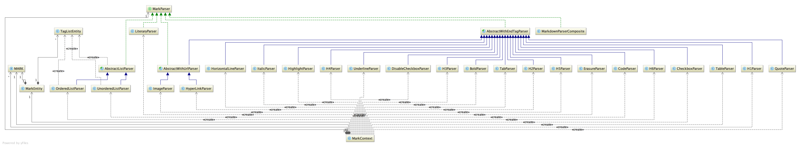

动机
---
markdown 已成为网络博客最主要的排版格式。但一般都是有现成的软件支持，比如有道云笔记。但要想将markdown  功能集成到自己的博客或者公司的oa 上，需要一款开源的轻量的markdown解析程序，从github 找了一些开源项目相对都比较重，二次开发成本较大，所以笔者在春节期间开发了一款轻量级的markdown解析程序，符合oop开发原则，最大化复用和解耦。方便二次开发集成。

功能
---
- 标题支持 H1 H2 H3 H4 H5 H6 
- 水平线支持 HORIZONTAL_LINE
- 引用支持 QUOTE
- TAB 引用
- 复选框支持 CHECK_BOX 
- 源代码支持CODE
- 高亮支持 HIGHLIGHT
- 下划线支持 UNDERLINE
- 擦除线支持 ERASURE
- 斜线支持ITALIC
 - 纯文本 LITERARY
 - 粗体支持BOLD
 - 图片支持IMAGE
  - 超链接持 HYPER_LINK
  - 有序列表 嵌套支持 ORDERED_LIST
  - 无序列表嵌套支持 UNORDERED_LIST
  - 表格支持 TABLE

优势
---
- 简洁
  代码复用度高，二次开发容易，方便集成。
- 高性能
 各标签通过逐步探测，事件逐动。
- 安全
  后端支持对xss等危险代码可进行过滤操作。
- 开源支持
sparrow-markdown是sparrow的成员之一，有问题会及时反馈。

架构及详细类图
---

源代码
---
[sparrow-markdown](https://github.com/sparrowzoo/sparrow-markdown)
test 下有demo可以直接运行
 
sparrow 环境依赖
---
[sparrow-readme](https://github.com/sparrowzoo/sparrow)