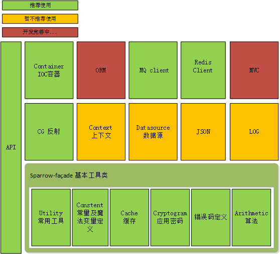

麻雀虽小，但五脏俱全 
---
sparrow 源自中国俗语 麻雀虽小，但五脏俱全，全力打造一个全新的低耦合，0依赖的高性能java 开发基础框架。
这个框架我从11年开始写，中间重构了n遍，最原始的代码可能都找不到了，之所以坚持写，最初并不是想造新轮子。 
主要是从中学习基础原理。 经过近十年的打磨，发现有些设计思想和理念，是值得学习的。比如spring mvc 的设计模式，orm ico 等等。 
虽然很多朋友们都了解，但要真正自己实现起来也并不是那么容易。而这个过程对原来的深入理解是很帮助，所以将这部分开源出来，
供有同样需求的朋友参考。在此过程中也发现了现有框架的一些弊端，比如没有一个跨数据源的orm。所有项目都需要依赖spring 才能跑起来，
使我们的业务依赖很多jar，而大部分的jar包可能是不需要的，代码变得臃肿，维护困难。
为此基于oop的基本思想，构建一层api,最大化的解耦。

框架特点
---
- 相信程序员

通过对原理有了更深入的了解，对写程序来讲会更简单，高效，很多框架之所以很重，很重要的一个原因是不相信程序员，这个框架从jdk出发，尽量不依赖第三方jar 包，让程序能跑起来，让程序更快。

- 从0开始

人脑思维是发散的，如果中间某个知识点断掉，可能就会产生知识盲点，这个盲点可能产生的影响很大的，尤其是技术更象是一层窗户纸，捅破了，简单，捅不破，如隔山。
所以我们从0开始，让知识连贯起来，消除盲点，不只让程序变得高效，更让程序员变得高效。

- 0依赖

框架实现最简单的，最核心的功能，尽量不依赖任何框架，包括spring。


- 解耦/隔离

sparrow模块 只定义了一些接口，具体实现在其他的模块中，是否依赖由业务端决定，最大化解耦。

- 扩展
 
遵循开闭原则，对业务提供扩展点。

项目架构及远期规划
---
架构中大部分功能已具基本的使用框架，但还需要进一步完善和优化，具体内容可查看架构详细介绍

jedis和rocket mq 客户端已具备基本的生产环境使用条件

其它模块还需进一步完善，欢迎有兴趣的小伙伴，一起加入
email:zh_harry#163.com



[架构详细介绍 https://www.jianshu.com/p/74122495a463](https://www.jianshu.com/p/74122495a463)


start
-----
-  下载项目管理壳子sparrow-shell，通过该项目可以下载sparrow所以子项目
    GIT 地址: git@github.com:sparrowzoo/sparrow-shell.git
    具体操作见该项目 [readme.md](https://github.com/sparrowzoo/sparrow-shell)
- style 目录为codestyle 和checkstyle 及copyright 相关配置文件，朋友们可自行配置.
    
- 编译sparrow-super 项目 该项目包括sparrow 所有依赖的jar,共用配置文件及sparrow 子项子的全局版本号,目前所有还没有上传至maven 仓库，感兴趣的朋友可以fork版本自行控制，待代码稳定后逐步上传至maven仓库共享。
    maven编译命令
    ```
    cd sparrow/sparrow-super
    mvn clean install -U -Dmaven.test.skip
    ```
- 回到父项目根目录
    
    ```
    cd ..  
    mvn clean install -U -Dmaven.test.skip
    ```

- sparrow 为保持代码整洁，所有的test 项目单独由一个sparrow-test 项目管理，该项目已有部分功能通过test case,朋友们可以下载了解sparrow 运行

     [测试用例 https://github.com/sparrowzoo/sparrow-test](https://github.com/sparrowzoo/sparrow-test)
 case 逐步完善中...
 
 
-  后绪重点会开发orm(跨数据源 db elastic search hbase) 和mvc两大重要模块，敬请期待...

我们的愿景和未来
--------
让程序员脱离spring, 也能写代码,而且更快，更优雅

